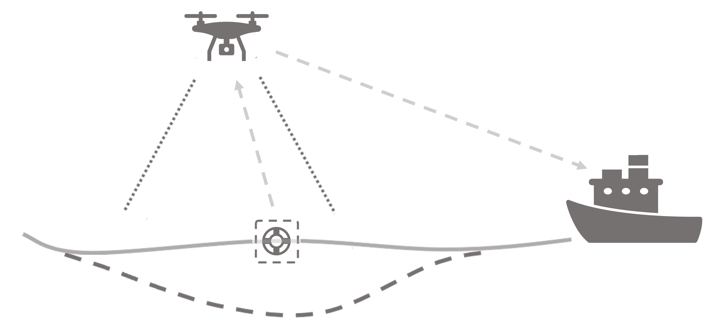
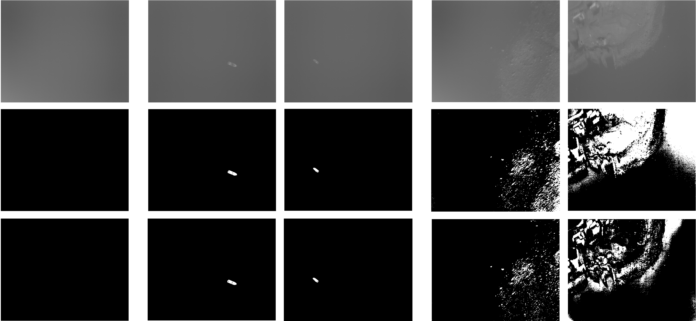
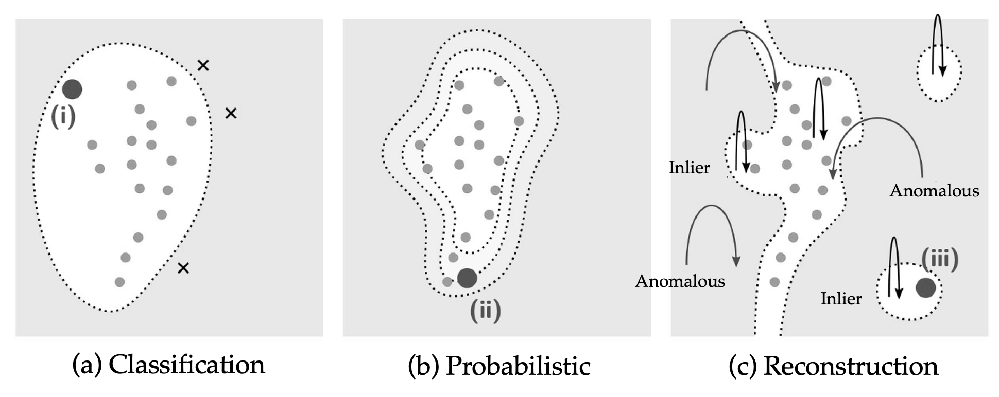
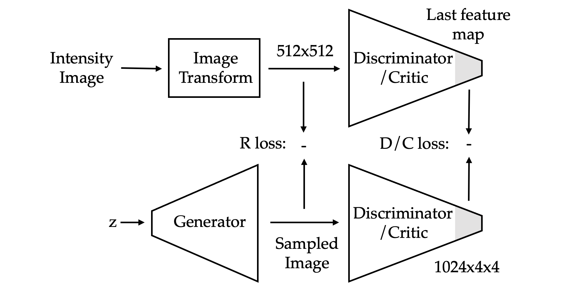

# Anomaly Detection in Maritime Environments in LWIR Imaging Using Unmanned Aerial Vehicles
### Ola Tranum Arnegaard - Master's thesis June 2022

Code repository for the various files created and used in the research conducted in the Master's thesis.

## Overview

### Illustration of the application presented in the paper

### Flight 1 results from adaptive PCA

### Summary of the underlying techniques explored in the method-review

### Overview of the inference of the deep anomaly detection learning model, AnoGAN

